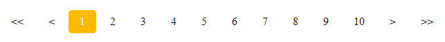
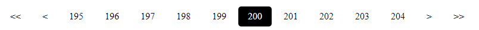
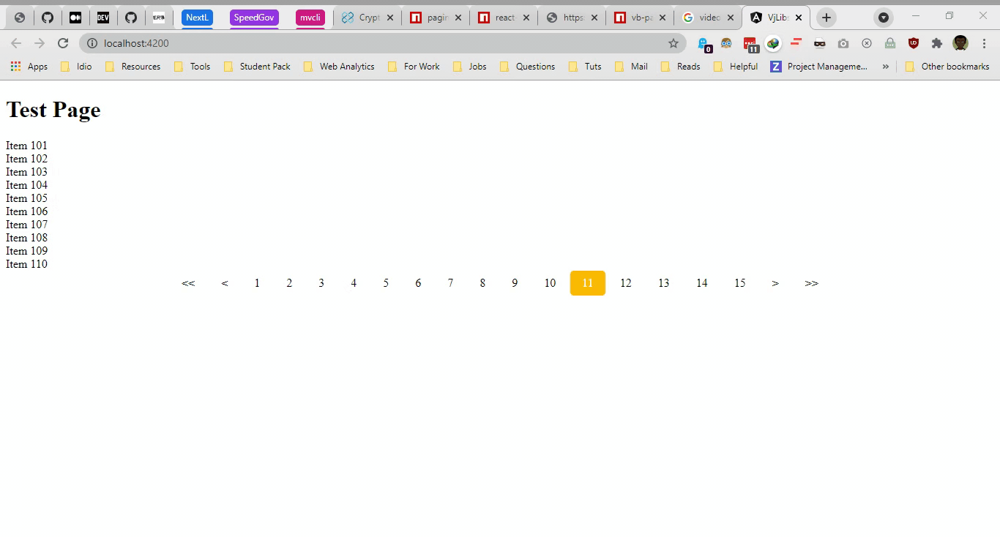

# Pagiinator

[](https://nodei.co/npm/pagiinator/)
[](https://badgen.net/npm/dt/pagiinator)
[](https://opensource.org/licenses/MIT)
[](https://img.shields.io/npm/v/pagiinator?style=flat-square)
[](https://hitcounter.pythonanywhere.com/count/tag.svg?url=https%3A%2F%2Fgithub.com%2Fbolorundurovj%2Fpagiinator)
<a href="https://www.npmjs.com/package/pagiinator">
</a>
<a href="https://www.npmjs.com/package/pagiinator">

</a>

<a href="https://www.jsdelivr.com/package/npm/pagiinator">

</a>

**A highly customizable pagination component library.**

By installing this component and writing only a little bit of CSS you can obtain this:



or



## Installation

Install `pagiinator` with [npm](https://www.npmjs.com/):

```
npm install pagiinator --save
```

In your App Module add:

```javascript
import { PagiinatorModule } from "pagiinator";
```

## Demo



## Props

| Name         | Type       | Description                                                                                |
| ------------ | ---------- | ------------------------------------------------------------------------------------------ |
| `items`      | `Number`   | **Required.** Array of data to be paginated                                                |
| `maxPages`   | `Number`   | **Required.** The range of pages displayed.                                                |
| `pageSize`   | `Number`   | **Required.** The number of items to display per page.                                     |
| `textColor`  | `String`   | Color of the text.                                                                         |
| `bgColor`    | `String`   | Background color for active page.                                                          |
| `position`   | `Node`     | Position on page ('left', 'center', 'right').                                              |
| `changePage` | `Function` | The method to call when a page is clicked. Exposes the current page object as an argument. |
